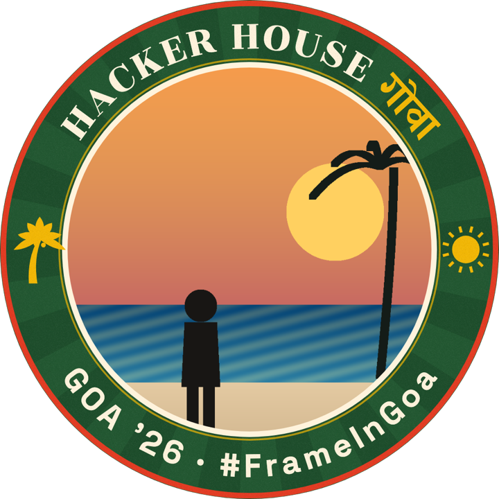
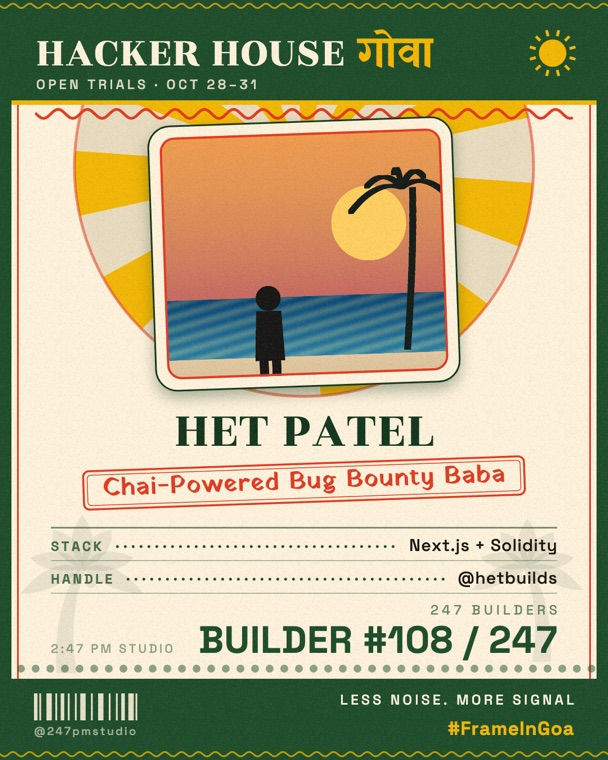
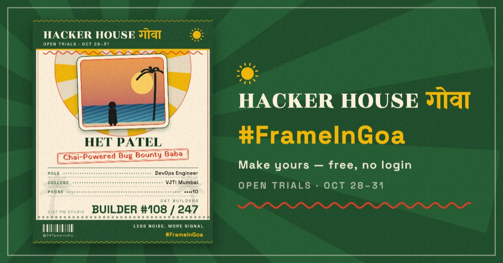
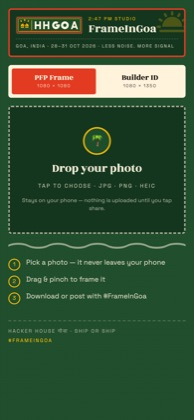
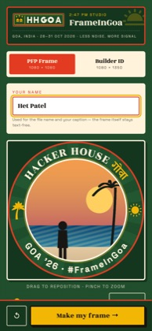
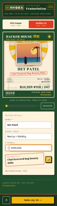
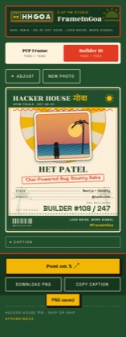
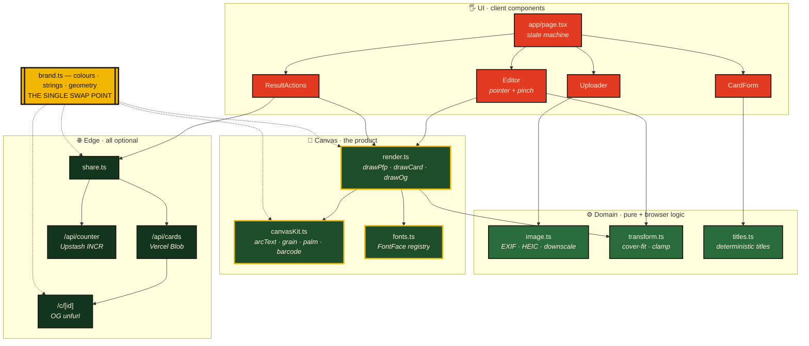
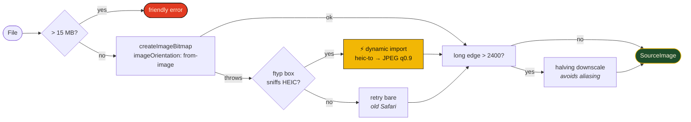
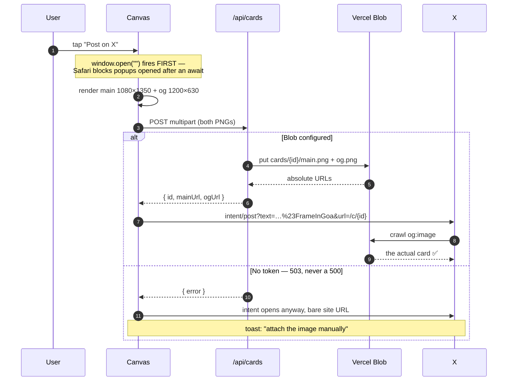

<div align="center">



# FrameInGoa

**Your details + a photo → a Hacker House Goa 2026 event ID card, *and* a branded profile frame.**
Two taps. No login. Nothing leaves your phone until you choose to share.

`#FrameInGoa`

<br>


</div>

---

## The two exports

<table>
<tr>
<td width="42%" align="center"><br><sub><b>Format A — PFP Frame</b><br>1080 × 1080 · circular crop · legible at 48px</sub></td>
<td width="58%" align="center"><br><sub><b>Format B — Builder ID Card</b><br>1080 × 1350 · 4:5, full-bleed in the X feed</sub></td>
</tr>
</table>

The ID card takes **photo · name · role in the team · college · phone**. Rows collapse when a field is left blank, so a sparse card still looks composed rather than half-empty.

> [!IMPORTANT]
> **The phone number is never printed in full.** The form collects it so an organiser can match a person at check-in, but the card renders only the last two digits — `••••10`. This graphic is built to be posted publicly, and a full number on a public image is a number handed to every stranger who sees the post. Masking happens at the render boundary in [`maskPhone`](lib/titles.ts), and there is deliberately no code path that draws the raw value.

And a third the user never sees — a 1200×630 Open Graph variant, composed **client-side** from the same canvas, so a shared link unfurls with the actual card instead of a blank thumbnail:

<div align="center"></div>

---

## The flow, in two taps

<table>
<tr>
<td align="center"><br><sub>1 · pick</sub></td>
<td align="center"><br><sub>2 · frame it</sub></td>
<td align="center"><br><sub>3 · your details</sub></td>
<td align="center"><br><sub>4 · post</sub></td>
</tr>
</table>

---

## Architecture

The whole product is a **rendering pipeline that happens to have a UI bolted to the front**. Nothing round-trips a server to produce a pixel — that is the entire reason it feels instant.

```
                                  ╱────────────────────────────────────────────╲
                                 ╱   app/page.tsx · Uploader · Editor · Card    ╲
             ┌──────────────────╱     Form · ResultActions · Toast              ╲
             │   UI LAYER      ╱          "use client" · Tailwind v4             ╲
             │                ╱──────────────────────────────────────────────────╲
             │               │                     │                              │
             │               │                     ▼  RenderInput                 │
             ├───────────────┼────────────────────────────────────────────────────┤
             │              ╱────────────────────────────────────────────────────╲
             │             ╱  lib/image.ts    lib/transform.ts    lib/titles.ts   ╲
             │  DOMAIN    ╱   decode·EXIF     cover-fit·clamp     FNV-1a hash      ╲
             │  LAYER    ╱    HEIC·downscale  pan·pinch·zoom      deterministic     ╲
             │          ╱──────────────────────────────────────────────────────────╲
             │         │                      │                                     │
             │         │                      ▼  design-space draw calls            │
             ├─────────┼─────────────────────────────────────────────────────────────┤
             │        ╱──────────────────────────────────────────────────────────────╲
             │       ╱   lib/render.ts  ─── compositors ──▶  drawPfp · drawCard · OG  ╲
             │ CANVAS╱    lib/canvasKit.ts ─ primitives ──▶  arcText · grain · palm    ╲
             │ LAYER╱     lib/fonts.ts ──── FontFace ─────▶  await before ANY fillText  ╲
             │     ╱────────────────────────────────────────────────────────────────────╲
             │    │                        │                                             │
             │    │                        ▼  PNG Blob                                   │
             ├────┼─────────────────────────────────────────────────────────────────────┤
             │   ╱──────────────────────────────────────────────────────────────────────╲
             │  ╱  lib/share.ts ──▶ ① Web Share (files)  ② X intent + /c/{id}  ③ download ╲
             │ ╱   api/cards ─ Vercel Blob      api/counter ─ Upstash INCR (both optional) ╲
             │╱────────────────────────────────────────────────────────────────────────────╲
             └──────────────────────────────────────────────────────────────────────────────┘
                EDGE LAYER — the only code that can touch a network. All of it degrades to a
                             working app when every single env var is absent.
```

### Module graph



### The intake pipeline

Portrait iPhone photos landing sideways is the single most common bug in tools like this. Three specific things prevent it:



1. `imageOrientation: "from-image"` is what actually applies the EXIF rotation.
2. HEIC is detected by reading the **ftyp box bytes**, never the file extension — iOS hands out `.jpg`-named HEICs and empty MIME types.
3. `heic-to` is **dynamically imported**, so its ~3 MB WASM payload stays out of the main bundle. Most visitors upload a JPEG and never pay for it.

### Share — three independent routes

The task is judged on whether a post actually goes out, so no path is allowed to dead-end.



| | Route | Shown when | Result |
|---|---|---|---|
| ① | **Web Share** | `navigator.canShare({files})` | Native sheet, X attaches the real PNG. Caption is copied to the clipboard *first* — several apps silently drop share `text` when a file rides along |
| ② | **Post on X** | always | Link unfurls the generated card via `/c/{id}` |
| ③ | **Download + Copy caption** | always | Works everywhere, offline included |

---

## Design decisions worth defending

<table>
<tr><td width="34%"><b>Preview and export share one code path</b></td><td>

`drawFormat(ctx, format, input)` always draws in **design space** — 1080×1080 or 1080×1350. The preview applies `ctx.scale()` first; the export doesn't. The preview therefore *cannot* drift from the PNG, and exports are full-resolution regardless of screen DPR.

</td></tr>
<tr><td><b>Fonts are self-hosted, not <code>next/font/google</code></b></td><td>

Canvas does not block on webfonts — if `fillText` runs before the face is ready the browser silently substitutes and the first export is quietly wrong. `lib/fonts.ts` registers each face via the `FontFace` API and every compositor `await`s `ensureFontsReady()`. Self-hosting also means the app builds and runs with **no network at all**.

Rozha One and Yatra One ship split Latin/Devanagari subsets, registered under one family name with `unicodeRange`, so `HACKER HOUSE गोवा` renders from a single `ctx.font`.

</td></tr>
<tr><td><b>Builder titles are fated, not random</b></td><td>

`titleFor(name)` is FNV-1a over an NFC-normalised, case-folded name, with a murmur3 finalizer decorrelating the adjective and role picks. The same name yields the same title on every device, forever — that is the delight. A 🎲 walks a salt forward until the words visibly change.

</td></tr>
<tr><td><b>The phone number is masked at the render boundary</b></td><td>

Not in the form, not on submit — in `maskPhone`, the only function the compositor is given. `CardFields.phone` holds the full value for the form's own use, but nothing between it and the canvas can print more than the last two digits. Making it a property of the render path rather than a validation rule means a future field row cannot accidentally reintroduce the leak.

</td></tr>
<tr><td><b>Zero required configuration</b></td><td>

Every env var is optional. No Blob token → `/api/cards` returns a clean **503** and the UI falls back to routes ① and ③. No KV → the builder number falls back to `(hash(name) % 247) + 1`, which is stable across reloads so a user who exports twice gets the same badge.

</td></tr>
</table>

---

## Verified, not assumed

Every number below came from driving the real app in headless Chromium against a production build.

```
  browser suite ······ 23/23   360px overflow · 44px targets · every field labelled
                               503-not-500 · 405 on GET · /c/[id] 404s bad ids
  phone masking ······ 13/13   swept every input length 3–15, no leak possible
  caption + titles ··· 25/25   #FrameInGoa invariant · determinism · slug fallbacks
  typecheck ·········· clean   strict + noUncheckedIndexedAccess
  taps to result ····· 2       (spec allowed 3)
  first load JS ······ 119 kB  WASM decoder confirmed split out
  export size ········ 1080×1350 verified byte-level on the downloaded PNG
```

Two of those are worth calling out because they are the ones that would be embarrassing to get wrong:

- **`grep` the exported PNG for the phone digits — they are not there.** Not the visible pixels, not the metadata. Asserted on the actual downloaded bytes, not on the input.
- **`#FrameInGoa` survives every caption branch**, including the truncation path and all 247 builder numbers. The submission is invalid without it, so it is a tested invariant rather than a string someone hopes stays put.

The caption that goes out with every post:

```
Locked in for Hacker House Goa 🌴 Builder #041/247 reporting.
Make yours → https://your-project.vercel.app #FrameInGoa @247pmstudio
```

---

## Run it

```bash
npm install
npm run dev        # http://localhost:3000
```

```bash
npm run build      # production build
npm run typecheck  # tsc --noEmit
```

No `.env` needed. See [`.env.example`](.env.example) for the optional extras.

## Deploy

Vercel, zero config. Optionally attach a Blob store to enable the unfurling share link, and set `NEXT_PUBLIC_BLOB_BASE_URL` to its public base.

## Brand assets

`public/brand/*.svg` are placeholders drawn in the matchbox style. Dropping the official HH Goa Brand Kit in with the same filenames is a zero-code swap; [`lib/brand.ts`](lib/brand.ts) is the only file holding colours, event strings and geometry.

<div align="center">
<br>
<sub><b>HACKER HOUSE गोवा</b> · GOA, INDIA · 28–31 OCT 2026 · <i>LESS NOISE. MORE SIGNAL</i></sub>
<br><br>
<sub>Demo photo is a generated placeholder illustration, not a real photograph.</sub>
</div>
